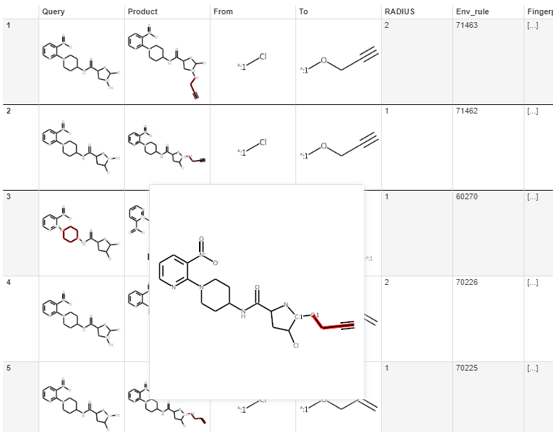

# MMPDB Notes

## Modifications to MMDBP2 and MMPDB3

Code in [my fork of MMPDB](https://github.com/jones-gareth/mmpdb)

- [MMPDB2](https://github.com/jones-gareth/mmpdb/tree/return_extra)
- [Comparison of my version of MMPDB2 with official RDKit branch](https://github.com/rdkit/mmpdb/compare/master...jones-gareth:return_extra)
- [MMPDB3](https://github.com/jones-gareth/mmpdb/tree/return_extra_v3)

In both versions of MMPDB I modify the make_transform method (in analysis_algorithms.py) to return the `constant smiles` and 
`variable smiles` in addition to the property rule.

We use this additional information to construct visualizations of the rule applied to the query structure.

## Postprocessing of MMPDB output

The results from transforming an `input query molecule` are processed as follows.

1. For each output query - product pair:
2. Create the `output query molecule` by combining the `constant smiles` with the `from smiles`. 
   This representation contains labelled variable atoms and attachment points and highlights the variable region.
   The `constant smiles` is required for this as there may be multiple matches between the `from smiles` and the 
   `input query molecule` (though I suppose we could just use the first, or somehow expand all matches- I assume that a
   rule only matches once against a query).
3. Similarly, create a `product molecule` by combining the `constant smiles` with the `to smiles`.
4. Copy `input query molecule` coordinates to the `output query molecule` (for depiction)
5. Using the largest fragment in the constant smiles create a template from the `input query molecule`.  With this template to 
   generate depiction coordinates for the `product molecule`, so that the product is aligned to the query.
6. Identify the `minimal difference` between the query and product.  Because the structures in the `to smiles`
   and `from smiles` may overlap MCS is required.  I have identified edge cases that show that 
   a whole molecule MCS is required (constrained by the constant region).  This calculation is too expensive
   (at least when implemented in Python!), so I currently use MCS on just the `from smiles`
   and `to smiles`- which works in the vast majority of cases.
   I currently use my own Python implementation of Bron-Kerbosch clique detection for 
   this, but should look at replacing with RDKit's `fMCS` method.
7. Use the `minimal difference` to create a fingerprint of `query molecule` atoms and bonds that are missing in the
   `product molecule`.  This is used in the UI- the user may mouse over or select portions of the `input query molecule`
   to highlight or filter pairs that modify portions of the molecule. 
8. Use the `from smiles` mapping to the `output query molecule` to create a second fingerprint that identified the pair.
   To be used in the UI in a similar fashion as the fingerprint in (7).

### Migrating MMPDB2 to MMPDB3

A number of imports have changed.  In particular argument processing has migrated from `argparse` to `click`.

```python
from mmpdblib import commandline as mmp
mmp.main(args)
```
is now in MMPDB3
```python
from mmpdblib import cli as mmp
mmp.main(args=args, standalone_mode=False)
```

`standalone_mode=True` (the default) results in a call to `sys.exit()` which broke our database build scripts as they
make repeated calls to `mmp.main()`

The transform code also had to be migrated, but is a lot simpler in MMPDB3.  It is now called directly without running
through `argparse`

## C#

We have C# UI endpoint that uses SQL queries against the MMPDB database to retrieve the compound pairs and property
scores for a `rule envionment id`.

## UI


