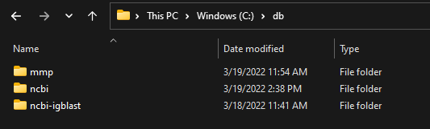

.. _getting-started:

Getting Started With Python Data Functions
==========================================

Data functions are defined in data function definition YAML files.  The YAML file contains a description of the
UI components and input fields to the data function.

Glysde provide a pre-built CPython instance containing `RDKit <https://rdkit.org>`_ and
`Biopython <https://biopython.org/>`_ modules.  Additionally, an
`API library <https://github.com/Glysade/DataFxnPylib>`_ is available. This library contains methods to read data
function requests, construct data function responses, convert columns to and from sequences or molecule, together
with modules for built in data functions.

The data function YAML file describes how Python data functions are executed.  If the **executorId** is set to
*Glysade.CPythonDataFxn* and the **serviceUri** is *glysade.python* then a script is executed if **serviceName** is
*Script*, otherwise the **serviceName** setting is use to specify a Python module and class to run the data function. Any
script to be run is specified in the **script** tag. The Python script should define a method called *execute* that takes
a :class:`~df.data_transfer.DataFunctionRequest` as an argument and returns a
:class:`~df.data_transfer.DataFunctionResponse` object.

Data Function Databases
***********************

Many of the data functions defined in the definition YAML require local resources such as
Blast, IGBlast and MMP databases.  These example databases may be downloaded as a ZIP archive from
`Dropbox <https://www.dropbox.com/s/82zqkp9kuaxbl4u/chemcharts_db.zip>`_.
The ZIP archive should be expanded in the root of
the C:\\ drive.

Exact Mass Example
******************

This data function returns a new column containing the exact masses of the molecules in the input column.

.. code-block:: python
   :linenos:

   from rdkit.Chem.Descriptors import ExactMolWt
   from df.chem_helper import column_to_molecules
   from df.data_transfer import DataFunctionRequest, DataFunctionResponse, DataType, ColumnData, \
        string_input_field

   def execute(request: DataFunctionRequest) -> DataFunctionResponse:
       column_id = string_input_field(request, 'structureColumn')
       input_column = request.inputColumns[column_id]
       mols = column_to_molecules(input_column)
       weights = [None if m is None else ExactMolWt(m) for m in mols]
       output_column = ColumnData(name=f'{input_column.name} Exact Mass', dataType=DataType.DOUBLE, values=weights)
       response = DataFunctionResponse(outputColumns=[output_column])
       return response

* Lines 1-4, required imports
* Line 7. The data function script must implement an execute method with this signature
* Line 8. The value of the *structureColumn* input field is extracted from the request using the helper
  method :meth:`~df.data_transfer.string_input_field`. This is the Spotfire columnId of the structure column
* Line 9. The :class:`~df.data_transfer.ColumnData` object containing the Spotfire input columns is in the Dict
  :attr:`~df.data_transfer.DataFunctionRequest.inputFields` keyed by columnId
* Line 10. Convert column values to RDKit molecules using the helper function :meth:`~df.chem_helper.column_to_molecules`
* line 11. Map the list of RDKit molecules to a list of exact masses, accounting for the fact that some molecules
  may be none
* line 12. Construct an output column of type :class:`~df.data_transfer.ColumnData` containing the exact masses
* lines 13-14. Construct and return the response of type :class:`~df.data_transfer.DataFunctionResponse`

Deprotect Example
*****************

RDkit contains a `method <https://www.rdkit.org/docs/source/rdkit.Chem.rdDeprotect.html>`_ to perform common
deprotection reactions.
This data function takes an input column of molecules and returns an output column of deprotected molecules together
with a second boolean column with rows set to True when a deprotection reaction has occurred.

..  code-block:: python
    :linenos:

     from typing import Optional

     from df.chem_helper import column_to_molecules, molecules_to_column
     from df.data_transfer import DataFunctionRequest, DataFunctionResponse, DataType, ColumnData, \
         string_input_field
     from rdkit import Chem
     from rdkit.Chem.rdDeprotect import Deprotect
     from rdkit.Chem.rdchem import Mol

     def compare_molecules(mol1: Optional[Mol], mol2: Optional[Mol]) -> bool:
         if not mol1 or not mol2:
             return False
         return Chem.MolToSmiles(mol1, True) != Chem.MolToSmiles(mol2, True)

     def execute(request: DataFunctionRequest) -> DataFunctionResponse:
         column_id = string_input_field(request, 'structureColumn')
         input_column = request.inputColumns[column_id]
         input_molecules = column_to_molecules(input_column)
         deprotected_molecules = [None if m is None else Deprotect(m) for m in input_molecules]
         changed = [compare_molecules(mol1, mol2) for mol1, mol2 in zip(input_molecules, deprotected_molecules)]
         output_molecules_column = molecules_to_column(deprotected_molecules, f'Deprotected {input_column.name}', DataType.STRING)
         changed_column = ColumnData(name='Changed', dataType=DataType.BOOLEAN, values=changed)
         response = DataFunctionResponse(outputColumns=[output_molecules_column, changed_column])
         return response

* Lines 11-14. This function returns True if two molecules are the same using a canonical smiles string comparison
* Line 21. Deprotects the the input molecules (accounting for null/None values)
* Line 22. Create values for a boolean column indicating if a molecule has changed (been deproctected)
* Line 23. Create an output column of structures for the deprotected molecules using the helper function
  :meth:`~df.chem_helper.molecules_to_column`

DNA Translation Example
***********************

In this example of a biological transform data function, DNA sequences are translated into protein sequences using
BioPython.

.. code-block:: python
   :linenos:

    from df.bio_helper import column_to_sequences, sequences_to_column
    from df.data_transfer import DataFunctionRequest, DataFunctionResponse, string_input_field

    def execute(request: DataFunctionRequest) -> DataFunctionResponse:
        column_id = string_input_field(request, 'sequenceColumn')
        input_column = request.inputColumns[column_id]
        input_sequences = column_to_sequences(input_column)
        codon_table_name = string_input_field(request, 'codonTableName', 'Standard')
        output_sequences = [None if s is None else s.translate(codon_table_name) for s in input_sequences]
        output_column = sequences_to_column(output_sequences, f'Translated {input_column.name}', genbank_output=False)
        response = DataFunctionResponse(outputColumns=[output_column])
        return response

* Lines 6-7. Extract the sequence column from the request in the same fashion as for molecular columns
* Line 8. Convert the sequence column to a list of sequence records using the helper function
  :meth:`~df.bio_helper.column_to_sequences`
* Line 9. A second input field with id *codonTableName* may be used to specify an alternative codon table
* Line 10. Use Biopython to translate the input DNA or RNA sequences to protein sequences accounting for null/None
  values.
* Line 11. Create an output column for the protein sequences using the helper function
  :meth:`~df.bio_helper.sequences_to_column`

Debugging and Developing Python Data Functions
**********************************************

If a data function Python script has been created using the *Developer* tab of the *Charts* *Data Function* visual, it
is relatively simple to debug and code that data function script using `PyCharm <https://www.jetbrains.com/pycharm/>`_

In the final step of the data function development wizard you are prompted to export the data function definition to a folder.
After doing this, navigate to the folder and run the *pycharm.bat* file.  Assuming you have installed PyCharm, and
either *pycharm.cmd* or *pycharm64.exe* are on your path, PyCharm will open and create a new project in the folder.

Unfortunately, it is not possible to automate adding the Glysade CPython distribution to Pycharm.  If you have already
defined a python interpreter in PyCharm, the first time PyCharm is used to open a data function the correct path to the
Glysade Python interpreter must be added as described
`here <https://www.jetbrains.com/help/pycharm/configuring-python-interpreter.html>`_. The interpreter path is listed
in the text of the *pycharm.bat* file.

The following files are available in the project:

#. *script.py*: the script block from the data function definition
#. *in.json*: example data function JSON input data
#. *main.py*: a script that reads *in.json* calls the data function in *script.py* and writes the result to *out.json*
#. *test.py*: a unit test template
#. *command.bat*: a batch file that run *main.py* with the correct environment and Python interpreter.
   Once in production it is this script that runs the data function

One the data function is working satisfactorily, to create the required data function YAML, the contents of *script.py*
can be pasted into the script dialog in the *Developer* tab of the *Charts* *Data Function* visual.

Fixing Broken Data Functions
****************************

When a Python data function fails to run, an error message is posted as a Spotfire notification.  The error message will
contain the path of the data function job directory.

The job directory contains the files listed in `Debugging and Developing Python Data Functions`_. *Command.bat* may be
run to reproduce the data function error and *script.py* can be edited to resolve the error.  Once the script is fixed
the data function definition YAML can be updated.

